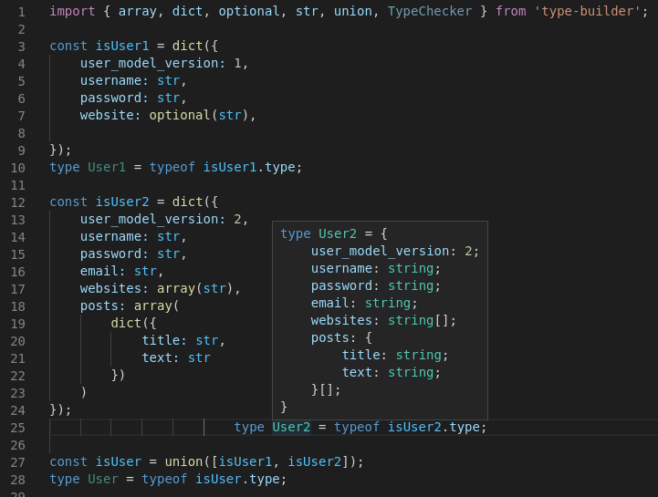

# TypeScript type builder
An extensible TypeScript type builder that produces a function to verify the type. Using an editor compatible with TypeScript will enable autocomplete with the correct types.

Note: if the TypeScript ```strictNullChecks``` option is set to false, then every type will always be optional, even though the checker function will not allow ```null``` or ```undefined```. It is best to have the option set to true.

### Installation:

```npm i type-builder```

### Example:
```typescript
import { array, dict, optional, str, union } from 'type-builder';

const isUser1 = dict({
	user_model_version: 1,
	username: str,
	password: str,
	website: optional(str),
	
});
type User1 = typeof isUser1.type;

const isUser2 = dict({
	user_model_version: 2,
	username: str,
	password: str,
	email: str,
	websites: array(str),
	posts: array(
		dict({
			title: str,
			text: str
		})
	)
});
type User2 = typeof isUser2.type;

const isUser = union([isUser1, isUser2]);
type User = typeof isUser.type;

var data = {
	user_model_version: 2,
	username: "Alice",
	password: "p@ssw0rd",
	email: "alice@example.com",
	websites: ["example.com"],
	posts: [
		{
			title: "Hello world!",
			text: "Hello world!"
		}
	]
};

if (!isUser(data)) {
	throw Error("Invalid data!");
} else {
	if (data.user_model_version === 1) {
		console.log(data.username + "'s profile is version 1");
	} else {
		console.log(data.username + "'s profile is version 2. Their websites: " + data.websites.join(", "));
		data.posts.forEach(x => {
			console.log(x.title + ": " + x.text);
		});
	}
}
```



Expected output:

```
Alice's profile is version 2. Their websites: example.com
Hello world!: Hello world!
```

And TypeScript will correctly infer the type of ```data```.

### TypeChecker<T>

This type represents a function that checks whether a passed argument is of type ```T```. Each of the types in the next section are or return a ```TypeChecker```. Additionally the type has a property ```TypeChecker<T>.type``` whose type is ```T```, which can be used to get the type (i.e. by using ```typeof checker.type```). This property does not actually exist on the type checkers.

## Built-in types:

### bool

Checks whether a passed argument is a boolean.

### num

Checks whether a passed argument is a number.

### str

Checks whether a passed argument is a string.

### literal(x)

Checks whether a passed argument is equivalent to the provided literal ```x```. ```x``` must be a boolean, number, or string.

### array(type)

Checks whether a passed argument is an array that only contains the provided ```type```. ```type``` can be another ```TypeChecker```, or it can be a boolean, number, or string literal.

##### Examples:
- ```array(5)```: checks whether an array contains only the number ```5```. Equivalent to ```array(literal(5))```.
- ```array(str)```: checks whether an array contains only strings.
- ```array(array(num))```: checks whether an array contains only arrays of numbers.

### dict(type)

Checks whether a passed argument is a dictionary with the properties defined in ```type```. Each property of ```type``` may be another ```TypeChecker```, or it can be a boolean, number, or string literal.

##### Examples:
- ```dict({a: optional(5), b: str, c: "some text"})```

### strDict(type)

Checks whether every property inside an object is of type ```type```. ```type``` may be another ```TypeChecker```, or it can be a boolean, number, or string literal.

##### Examples:

- ```strDict(array(num))```: checks whether every parameter in an object is an array of numbers.

### optional(type)

Checks whether a passed argument is either ```undefined```/```null``` or is of type ```type```. ```type``` may be another ```TypeChecker```, or it can be a boolean, number, or string literal.

### union(types)

Checks whether a passed argument matches any of the types in ```types```. ```types``` must be an array containing ```TypeChecker```s, boolean literals, number literals, or string literals.

##### Examples:

- ```union([str, num])```: checks whether the passed argument is either a string or a number.

### intersection(types)

Checks whether a passed argument matches all of the types in ```types```. ```types``` must be an array containing ```TypeChecker```s, boolean literals, number literals, or string literals.

##### Examples:

- ```intersection([array(str), dict({length: 5})])```: checks whether the passed argument is an array of strings and has a ```length``` of 5.

## Making a custom TypeChecker:

A custom ```TypeChecker``` is just a function that returns the type ```x is T```.

For example, code for a ```TypeChecker``` that verifies whether a string has a certain length could look like this:

```typescript
import { TypeChecker, str } from 'type-builder';

function stringRange(min: number, max: number): TypeChecker<string> {
    return <TypeChecker<string>> ((x: any): x is string => str(x) && x.length >= min && x.length <= max);
}
```

The cast to `TypeChecker<string>` is necessary to make sure a phantom property ```type``` appears on the type of the returned value.
